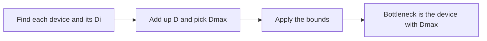

# COMP5348 Week 8 - Learning Guide, Predicting performance and queues, plus REST

Eight ideas, biggest first. Ideas 1 to 5 are the calculation family from the slide "Work is done at different devices", which is the most important part of the week. They all share one running example, so learn it once.

Running example: a job is one complete client request. It visits a CPU 2 times and a database 3 times. Each visit takes 20 ms. Clients wait Z = 5 s between requests.

---

## Idea 1. Work per job at each device: Vᵢ, Sᵢ and Dᵢ

Analogy: a coffee shop has a cashier and a barista. Each customer needs the cashier twice and the barista three times, 20 seconds per visit. The barista is busy longer per customer, so the barista jams up first.

Worked example:

• CPU: V = 2, S = 20 ms, so D = 2 × 20 ms = 40 ms = 0.04 s.

• Database: V = 3, S = 20 ms, so D = 3 × 20 ms = 60 ms = 0.06 s.

• The database has the larger D, so it is the bottleneck.

• Total D = 0.04 + 0.06 = 0.10 s, and the biggest single one, Dmax, is 0.06 s.

Jargon decoder:

• Device i: any one resource, such as the CPU or the database.

• Vᵢ: visits one job makes to device i.

• Sᵢ: time actually being served per visit, not counting waiting in line.

• Dᵢ = Vᵢ × Sᵢ: service demand, the serving time one job needs from device i.

• Bottleneck: the device with the largest Dᵢ.

---

## Idea 2. Rates at a device: μᵢ, λᵢ, Xᵢ and Uᵢ

Analogy: the barista takes 20 seconds per drink. Working non-stop she could make 3 drinks a minute. If only 1 drink a minute is ordered, she is busy one third of the time.

Worked example: the database has S = 20 ms = 0.02 s per visit.

• Service rate μ = 1 / S = 1 / 0.02 = 50 visits per second, the most it could do if never idle.

• If 30 visits per second arrive, λ = 30, so utilisation U = λ × S = 30 × 0.02 = 0.6, meaning 60 percent busy.

• If it keeps up, what arrives also leaves, so throughput X equals λ = 30.

Jargon decoder:

• μᵢ: service rate, visits per second the device could finish if always busy. It equals 1 / Sᵢ.

• λᵢ: arrival rate, visits per second arriving at device i.

• Xᵢ: throughput, visits per second actually completed.

• Uᵢ = λᵢ × Sᵢ: utilisation, the fraction of time the device is busy. It never exceeds 1.

---

## Idea 3. From one device to the whole system: Forced Flow and Service Demand Law

Analogy: if the shop serves 10 customers a minute and each visits the barista 3 times, she handles 30 visits a minute. Her busyness is the time each customer needs from her, times customers per minute.

Worked example: the whole system finishes X = 10 jobs per second.

• Forced Flow Law: Xᵢ = Vᵢ × X. Database: 3 × 10 = 30 visits per second. CPU: 2 × 10 = 20.

• Service Demand Law: Uᵢ = Dᵢ × X. CPU: 0.04 × 10 = 0.4. Database: 0.06 × 10 = 0.6. Neither is saturated.

• Utilisation cannot pass 1, so 0.06 × X ≤ 1, giving X ≤ 1 / 0.06 ≈ 16.67 jobs per second. The database saturates first.

Jargon decoder:

• X: throughput of the whole system, jobs per second.

• Xᵢ: throughput of one device, visits per second.

• Saturated: utilisation has reached 1, busy all the time.

• Service Demand Law is also called the Bottleneck Law.

---

## Idea 4. Little's law and the response time law

Analogy: a cafe has 6 people inside and 2 walk in per minute, so each stays about 3 minutes. Crowd, arrival rate and stay length are tied together.

Little's law: N = λT. Your own notes write it as L = λ × W. Same law, different letters.

Worked example: count the whole system, clients included.

• Each client cycles through waiting for a reply R, then thinking Z. So N = X × [R + Z], which rearranges to R = N / X − Z. This is the interactive response time law.

• Take N = 20 clients, Z = 5 s, measured X = 3.92 jobs per second.

• R = 20 / 3.92 − 5 ≈ 5.10 − 5 = 0.10 s.

• D = 0.04 + 0.06 = 0.10 s, so R ≈ D. Nobody is queueing at this load.

Jargon decoder:

• N: jobs in the system, or clients. λ: arrival rate. T: time in the system.

• R: response time, from request to reply.

• Z: think time between a reply and the next request.

---

## Idea 5. The two bounds and the knee point

Analogy: when a shop is quiet, your wait is just your own service time, since nobody is ahead of you. When it is packed, the wait is set by the slowest station.

Worked example with D = 0.10 s, Dmax = 0.06 s, Z = 5 s.

• Low-load bounds: R ≥ D = 0.10 s, and X ≤ N / [D + Z]. For N = 20 that is 20 / 5.10 ≈ 3.92 jobs per second.

• High-load bounds: X ≤ 1 / Dmax = 1 / 0.06 ≈ 16.67 jobs per second, and R ≥ N × Dmax − Z.

• The lines cross at the knee point N* = [D + Z] / Dmax = 5.10 / 0.06 = 85 clients. Beyond that, queues build up badly.

Jargon decoder:

• Bound: a limit the real value cannot beat, like a speed limit.

• Low load: few clients, real values sit near the low-load bounds.

• High load: many clients, real values sit near the high-load bounds.

• Knee point N*: where the two bounds cross.

---

## Idea 6. Planning for scale and redesign

Analogy: a restaurant owner asks how many diners fit before the average wait passes 2 minutes. She works it out from the slowest station, then decides which station to upgrade.

Worked example: keep average response time R at or under 2 s, with Dmax = 0.06 s and Z = 5 s.

• The high-load bound gives R ≥ N × 0.06 − 5, and we need R ≤ 2.

• So N × 0.06 ≤ 7, giving N ≤ 7 / 0.06 = 116.67, about 116 clients.

• Check: 116 × 0.06 − 5 = 1.96 s, and 117 × 0.06 − 5 = 2.02 s.

• It is a planning estimate from averages, not a promise for the 116th client.

• Redesign: the only way past X ≤ 1 / Dmax is to shrink Dmax by moving work off the bottleneck, adding devices, cutting visits or using a faster device. A new bottleneck then appears elsewhere.

Jargon decoder:

• Common mistake: re-using an old number that has changed. With more clients Dᵢ stays the same but Xᵢ and Uᵢ change.

---

## Idea 7. M/M/1 queues in one card

Analogy: one till with customers arriving at random. Busy half the time, waits are short. Busy nearly all the time, the queue explodes even though the till is no slower.

Worked example: the server handles μ = 10 jobs per second, so a job takes 0.1 s.

• Load ρ = λ / μ, and time in system T = 1 / [μ × [1 − ρ]].

• λ = 5: ρ = 50%, T = 0.20 s. λ = 8: ρ = 80%, T = 0.50 s.

• λ = 9: ρ = 90%, T = 1.00 s. λ = 9.5: ρ = 95%, T = 2.00 s.

• Jobs in system N = ρ / [1 − ρ], so 4 jobs at ρ = 0.8. Keep bottleneck load below about 0.8.

Jargon decoder:

• M/M/1: random Poisson arrivals, exponential service times, one server.

• ρ: load, the fraction of capacity in use.

• Heavy-tailed: a few huge jobs make queues even worse.

---

## Idea 8. REST verbs: safe, idempotent and what POST returns

Analogy: reading a menu changes nothing, so it is safe. Setting the thermostat to 21 degrees gives the same result however often you do it, so it is idempotent. Pressing "add one sandwich" repeatedly is neither.

Worked example: the payroll service.

• GET employees, and GET employees/7: safe and idempotent.

• PUT employees/7 replaces one, and DELETE employees/7 removes one: idempotent, not safe.

• POST employees creates one: neither, since repeating makes duplicates.

• A good POST answers 201 Created with a Location header holding the new address, such as employees/292.

• Stateless: the server keeps no session between requests, so each request carries everything needed.

Jargon decoder:

• Safe: changes nothing on the server.

• Idempotent: many times has the same effect as once.

• Backward compatible: adding firstName and lastName but keeping name, so old clients still work.
