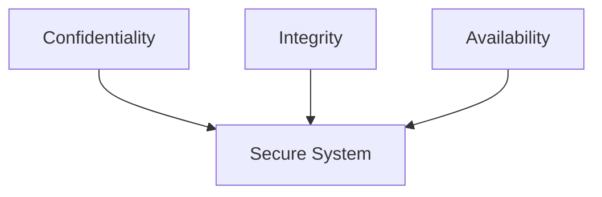
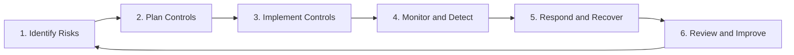
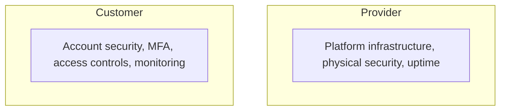
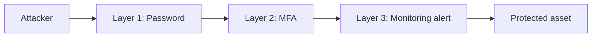
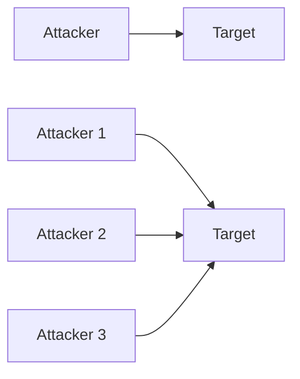
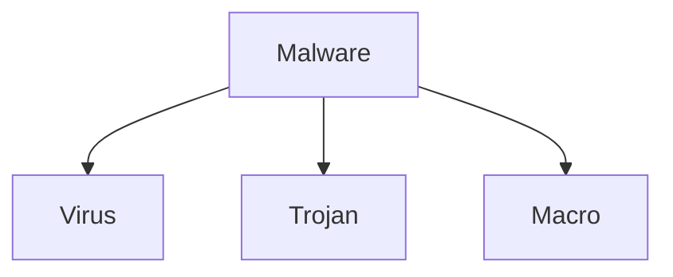

# INFO5990 Week 8 — Learning Notes (Security Management, explained simply)

## 1. The CIA Triad

Think of information security like a three-legged stool balancing one big idea called "secure information." If any one leg is weak or missing, the whole stool tips over, no matter how strong the other two legs are.

Worked example: a postman opens a plain letter, reads it, understands a private meeting time, then reseals it and delivers it — confidentiality is broken because an unauthorized person understood a secret. If the sender instead writes in code words, the postman opens it, reads the code, but does not understand it, then reseals and delivers it — confidentiality is not broken this time, because just touching protected information is not a breach; only actually understanding it counts.

Jargon decoder:
• CIA Triad — the three legs of the stool: Confidentiality (only the right people can read it), Integrity (the information is correct and hasn't been secretly changed), Availability (the information is there when you actually need it)
• NIST — National Institute of Standards and Technology, the US government body credited with popularising this model
• MFA — Multi-Factor Authentication, proving who you are with more than just a password, e.g. a phone code too

## 2. The Security Management Lifecycle

Think of it like the smoke-detector routine in a house — you don't just install a detector once and forget it. You keep checking the batteries, watching for smoke, putting out any fire that starts, then learning from it and upgrading the detectors, forever, on a loop.

Worked example: Step 1, you notice your office Wi-Fi router is running old, outdated firmware. Step 2, you plan a patch schedule and a new password rule. Step 3, you actually install the patch. Step 4, you watch the login logs for strange activity. Step 5, if someone does break in, you contain the damage and recover. Step 6, you review what let it happen and improve the plan — then the loop starts again at Step 1.

Jargon decoder:
• lifecycle — a set of steps that repeats forever in a circle, instead of stopping once finished
• control — a fix put in place to lower a risk, e.g. a patch, a password rule, or a locked door

## 3. The Shared Responsibility Model

Think of renting an apartment in a big building. The landlord is responsible for the locks on the main entrance and the fire escape, but you are responsible for locking your own apartment door and not handing your key to a stranger.

Worked example: in the Snowflake data breach, the cloud provider's own servers were not the problem — customers who skipped multi-factor authentication and reused stolen passwords are the ones who got broken into, exposing over 500 million records including Ticketmaster and Santander data. The landlord's locks held; some tenants left their own doors open.

Jargon decoder:
• Shared Responsibility Model — an agreement that splits security jobs: the cloud provider secures the building itself, the customer secures their own account and data inside it
• MFA — Multi-Factor Authentication, requiring a second proof of identity beyond just a password

## 4. Defense in Depth and Risk = Vulnerability x Threat

Think of a castle that never relies on just one gate — it has a moat, then a wall, then a locked door, then guards, so one failure alone doesn't let the enemy walk straight in.

Worked example: a hacker guesses your password, breaking through layer one. Multi-factor authentication then blocks them at layer two. If that somehow fails too, monitoring software alerts a human at layer three before real damage happens. The lecturer's formula for how worried to actually be: Risk equals Vulnerability multiplied by Threat — an unlocked window with no burglar nearby is low risk, and a determined burglar facing a locked, alarmed window is also low risk. Danger only spikes when both are high together.

Jargon decoder:
• vulnerability — a weak point in a system, like an unlocked window
• threat — someone or something that could actually exploit that weak point, like a burglar
• risk — the real level of danger, worked out by combining how weak the point is with how likely an attacker is to use it

## 5. DoS vs DDoS

A DoS attack is like one annoying person knocking on your door nonstop so you can never get anything else done. A DDoS attack is an entire mob knocking on your door from every direction at once, which is far harder to handle.

Worked example: one computer flooding Gmail's servers with fake requests is a DoS attack, so real users get slow responses. Thousands of hijacked computers around the world flooding Gmail at the exact same moment is a DDoS attack, and Gmail's defences cannot tell the flood apart from real customers trying to log in.

Jargon decoder:
• DoS — Denial of Service, one attacking machine overwhelming a target so legitimate users can't get through
• DDoS — Distributed Denial of Service, the same idea but launched from many attacking machines in many locations at the same time, which makes it more dangerous

## 6. Human threats: phishing, social engineering, and insiders

Think of a con artist who never bothers picking your lock — they simply trick you into handing over the key yourself, by pretending to be someone you already trust.

Worked example: an email that looks like it's from your own bank asks you to click a link and type in your password. That's phishing, a type of social engineering, and clicking it can do more damage than any firewall failure, because the attacker didn't break in — you let them in. The lecturer cited a survey finding roughly a 70 percent chance that someone inside the organization, on purpose or by accident, is involved whenever a security incident happens.

Jargon decoder:
• social engineering — tricking a person, rather than hacking a machine, into giving up access or secrets
• phishing — the email or message version of social engineering, aimed at stealing logins or card numbers
• insider threat — the risk that a current employee, whether careless or deliberately malicious, misuses access they were already legitimately given

## 7. Zero-day vulnerabilities and the malware family

Imagine a brand-new lock-picking trick that no locksmith on Earth has ever seen before. The moment it's used, no alarm system knows to watch for it, because nobody has taught any alarm what it looks like yet.

Worked example: a hacker discovers a flaw in an app the same day it's released, before the developers or any antivirus company even know the flaw exists. Because there's no known "fingerprint" for it yet, the attack can slip straight past defences that only catch known threats.

Jargon decoder:
• zero-day vulnerability — a security flaw that is brand new and unknown to defenders, so there are zero days of advance warning before it can be exploited
• malware — malicious software, the umbrella term for any code intentionally written to cause harm, with viruses, Trojans, and macros as its main sub-types
• antivirus — software that mostly works by matching code against a list of known bad patterns, so it can miss attacks it has never seen before

## 8. Access control and least privilege

Think of a hotel keycard — it opens your own room and maybe the gym, but it will never open the manager's office or another guest's room, even though you're a paying guest in the very same building.

Worked example: a university student account can browse the internet but cannot install random software. If that account gets stolen, the damage a thief can do is capped by how little access the account ever had in the first place — that's the whole point.

Jargon decoder:
• access control — the rules deciding who is allowed to do what on a system, often enforced with a password plus MFA
• least privilege — only ever giving someone the smallest amount of access needed to do their job, never extra "just in case"
• control types — technical (e.g. encryption), administrative (e.g. a written policy), and physical (e.g. a locked server room door) are the three flavours a control can come in
