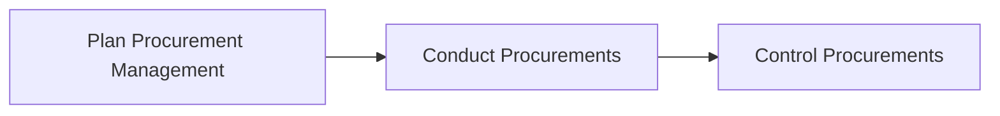
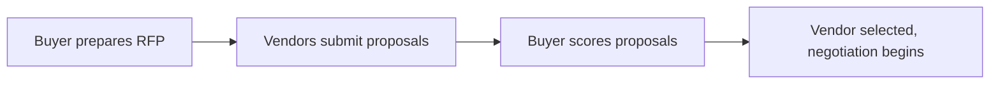
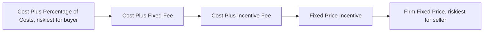
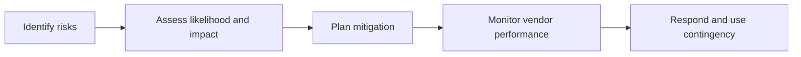

# INFO6007 Week 8 — Learning Notes: Procurement Management

Explained plainly, for someone who has never seen the jargon before. Eight ideas, picked because they carry the most exam weight this week.

## 1. Procurement management, the big picture

Imagine you are throwing a huge party but your kitchen cannot make everything yourself, so you go out and buy pizza, drinks, and hire a DJ instead of doing it all in-house. Procurement management is the planning behind those trips: deciding what to buy, from whom, and how to make sure you actually get what you paid for.

Worked example: the NSW Digital Driver Licence project could not do independent security testing itself, so the team planned to buy that testing from an outside specialist instead of building the skill internally, while keeping licence-system integration in-house.

Jargon decoder

• Procurement: buying goods, services or results from outside your own project team

• PMBOK: Project Management Body of Knowledge, the standard rulebook project managers use worldwide

There are three stages, always in the same order: plan what to buy, go get it, then keep an eye on the supplier.

## 2. Make-or-Buy Analysis

Think of deciding whether to cook dinner yourself or order takeout. Cooking costs you time, ingredients and effort you already own; takeout costs cash but saves your evening. A company faces the same choice for every project need: build the thing internally, or pay someone else to supply it.

Worked example from the slides: building a part internally totals 1,100,000 dollars once materials, labour, overhead, equipment lease, building rent and supervisor salaries are added up. Buying the same part from outside totals 1,190,000 dollars once the purchase price plus leftover overhead costs are added. Since making it internally is 90,000 dollars cheaper, Make is the better choice here.

Jargon decoder

• Make-or-Buy Analysis: comparing the cost, time, quality, control and strategic value of building something yourself versus purchasing it externally

The lesson: always run the numbers before assuming outsourcing is cheaper, because in-house can still win.

## 3. RFP versus RFQ

Picture asking a builder to quote a fixed job everyone understands, like laying a driveway, versus asking several architects to pitch their own creative design for a new house. The driveway job just needs a price; the house needs ideas as well as a price.

Jargon decoder

• RFQ, Request for Quotation: a document asking suppliers for a price on something clearly defined and standard, like office chairs or IT licenses. Fastest to run, decided mostly on cost

• RFP, Request for Proposal: a document inviting vendors to propose their own solution for a complex or unclear need, like building custom software. Decided on quality, approach and price together

Worked example: the NSW project issued an RFP for independent security testing, because the approach needed vendor expertise, then would use an RFQ for standard, off-the-shelf items.

## 4. Contract types and who carries the risk

Imagine three ways to pay a carpenter for renovating a room. You either agree on one fixed total no matter how long it takes, you pay back whatever they actually spend plus a fee, or you pay by the hour plus materials. Each option shifts risk between you and the carpenter.

Jargon decoder

• Fixed-Price: one agreed total price; the seller absorbs the risk if costs run over

• Cost-Reimbursable: buyer repays the seller's actual costs plus a fee; the buyer absorbs the risk of overruns

• Time and Materials: hybrid, paid by hours and materials used; medium risk on both sides

Worked example: for a homeowner hiring a carpenter, Fixed-Price is best because the price is locked in regardless of delays. For the carpenter, Cost-Reimbursable or Time and Materials is better because extra hours or costs get paid.

Riskiest for the buyer sits at one end and riskiest for the seller sits at the other.

## 5. Choosing a vendor evaluation method

Think of hiring a babysitter three different ways: sometimes you just need a checklist of must-haves like a first-aid certificate, sometimes you weigh several qualities like experience and friendliness together, and sometimes you keep scoring the same regular babysitter every month to see if standards are slipping.

Jargon decoder

• Checklist: pass or fail against minimum required standards, used when compliance is critical

• Weighted Scoring Model: each factor gets a percentage weight, scores are multiplied by that weight and added up, used when many factors matter besides price

• Vendor Scorecard: ongoing scoring of a vendor already under contract, tracked over time like a report card

Worked example: comparing two suppliers on integrity, industry expertise, experience and financial strength, each weighted differently, gave Supplier B a total of 2.75 versus Supplier A's 1.90, even though Supplier B scored zero on financial strength, because its much higher expertise and experience scores outweighed that gap.

A university choosing a caterer mainly for food-safety and hygiene compliance would use a Checklist, since price and menu variety are secondary here.

## 6. Managing procurement risk

Imagine ordering a custom cake for a wedding. Things that could go wrong include the price rising last minute, the bakery running late, the cake tasting wrong, or a contract dispute over what was promised. Procurement risk management is planning for all of these before they happen.

Jargon decoder

• Procurement risk: the chance that a vendor relationship, contract or delivery threatens the project, grouped into cost, schedule, quality, compliance and operational risks

The five steps always run in the same order: spot the risks, judge how likely and how bad each one is, plan a response, watch vendor performance continuously, and keep a backup plan ready in case something still goes wrong.

## 7. Project outsourcing types and sourcing models

Picture a restaurant that cooks its signature dish in-house but hires an outside cleaning company for the kitchen. That is partial outsourcing: keep the core skill, hand off the rest. Some restaurants hand the entire kitchen to a franchise operator instead, which is complete outsourcing.

Jargon decoder

• Complete Project Outsourcing: one vendor runs the whole project start to finish

• Partial Project Outsourcing: only specific tasks are handed off, the rest stays in-house

• Onshore, Nearshore, Offshore: the vendor is in the same country, a nearby country, or a distant country

• Insourcing: the opposite of outsourcing, moving work to another internal team instead of an external vendor

Worked example: Australia's three car makers, Holden, Ford and Toyota, all stopped local manufacturing between roughly 2015 and 2020 mainly because local labour was too expensive, which is the same cost-efficiency reason companies outsource IT work offshore today.

## 8. Controlling procurements after the contract is signed

Think of hiring a contractor to renovate your kitchen. Signing the contract is not the end of your job, you still need to check their work at each stage, confirm they hit deadlines, and only pay once you are satisfied it was actually done properly.

Jargon decoder

• Control Procurements: managing the vendor relationship after award, checking performance against the contract, and approving any changes formally

• SLA, Service Level Agreement: a standard promising a response within a set time, for example a university replying to an exam complaint within a set number of business days

Worked example: the NSW Digital Driver Licence project reviewed test reports and milestone evidence, approved changes formally, and only released payment once deliverables were formally accepted, rather than paying upfront and hoping the vendor delivered.

